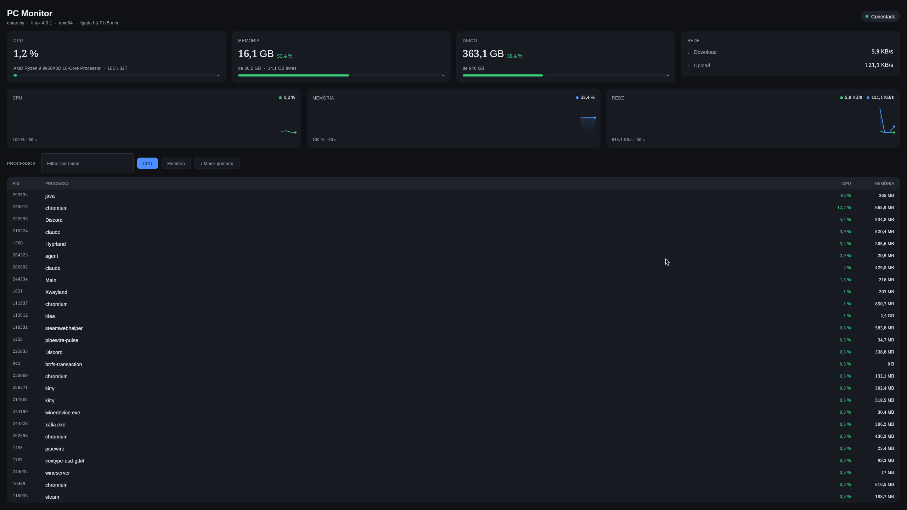

# PC Monitor

Monitor de recursos do computador em tempo real: um agente em Go que lê o
sistema e um aplicativo desktop em Kotlin Multiplatform que mostra o resultado.



- **Agente:** Go (`agent/`) — REST + WebSocket em `127.0.0.1:8080`
- **Desktop:** Kotlin Multiplatform + Compose Multiplatform (`desktop/`)

---

## O que ele mostra

| | |
|---|---|
| CPU | modelo, núcleos, threads e uso |
| Memória | total, usada, disponível e percentual |
| Disco | capacidade e uso por dispositivo |
| Rede | download e upload em tempo real |
| Processos | PID, nome, CPU e memória, com filtro e ordenação |
| Histórico | últimos 60 segundos de CPU, memória e rede |

As métricas chegam por WebSocket a cada segundo. Se o agente cair, a janela
continua aberta com a última leitura e reconecta sozinha.

---

## Arquitetura

```
┌──────────────────────────┐        ┌───────────────────────────┐
│  Agente (Go)             │        │  Desktop (KMP + Compose)  │
│                          │        │                           │
│  collector ──► service ──┼── REST─┼──► network ──► repository │
│      │            │      │  + WS  │                    │      │
│   /proc, gopsutil  └─ hub ┼───────┼──────────► viewmodel      │
│                          │        │                    │      │
│                          │        │                   ui      │
└──────────────────────────┘        └───────────────────────────┘
```

Regras que o código segue:

- collectors não conhecem HTTP;
- models não dependem de HTTP;
- Composables não conhecem Ktor;
- o ViewModel não faz HTTP — depende de contratos (`MetricsSource`,
  `ProcessesSource`).

Uma coleta por intervalo alimenta **todos** os clientes conectados: dez janelas
abertas não viram dez varreduras de `/proc` por segundo.

---

## Requisitos

Para **rodar** o que já está empacotado: nada além do Linux.

Para **compilar**:

| | Versão |
|---|---|
| Go | 1.24+ |
| JDK | 21 |
| Linux | o agente lê `/proc` (gopsutil) |

---

## Como executar

### Os dois juntos (recomendado)

```bash
scripts/build.sh    # compila agente e desktop em dist/
scripts/start.sh    # sobe os dois; fechar a janela encerra o agente
```

### Durante o desenvolvimento

```bash
# terminal 1
cd agent && go run ./cmd/server

# terminal 2
cd desktop && ./gradlew :composeApp:run
```

### Testes

```bash
cd agent   && go test ./...
cd desktop && ./gradlew :composeApp:jvmTest
```

---

## Configuração

| Variável | Padrão | Onde vale |
|---|---|---|
| `PCMON_HOST` | `127.0.0.1` | agente |
| `PCMON_PORT` | `8080` | agente |
| `PCMON_COLLECTION_INTERVAL` | `1s` | agente |
| `PCMON_LOG_LEVEL` | `info` | agente |
| `PCMON_AGENT_URL` | `http://127.0.0.1:8080` | desktop |

```bash
PCMON_PORT=8123 scripts/start.sh    # o script repassa a porta ao desktop
```

O agente escuta só em loopback: não há autenticação, e a API expõe a lista de
processos da máquina.

---

## Endpoints

```
GET  /health
GET  /api/v1/system
GET  /api/v1/cpu
GET  /api/v1/memory
GET  /api/v1/disks
GET  /api/v1/network
GET  /api/v1/processes?sort=cpu|memory&limit=1..500
GET  /api/v1/metrics
WS   /api/v1/ws/metrics
```

Contratos, exemplos reais e erros em **[`docs/api.md`](docs/api.md)**.

---

## Documentação

- [`plan.md`](plan.md) — especificação
- [`spec-driven-tasks.md`](spec-driven-tasks.md) — roadmap em tarefas
- [`docs/api.md`](docs/api.md) — contratos da API
- `docs/epic-*.md` — o que foi decidido em cada etapa, e por quê

---

## Estrutura

```
agent/
├── cmd/server/          bootstrap
└── internal/
    ├── api/             handlers HTTP, WebSocket, middleware
    ├── collector/       leitura do sistema (gopsutil)
    ├── config/          variáveis de ambiente
    ├── model/           contratos JSON
    └── service/         regras e agregação, hub de publicação

desktop/composeApp/src/commonMain/kotlin/pcmonitor/
├── model/               espelho dos contratos
├── network/             cliente Ktor (REST + WebSocket)
├── repository/          fronteira de dados
├── viewmodel/           estado da tela
└── ui/                  Compose

scripts/                 build.sh, start.sh
```
